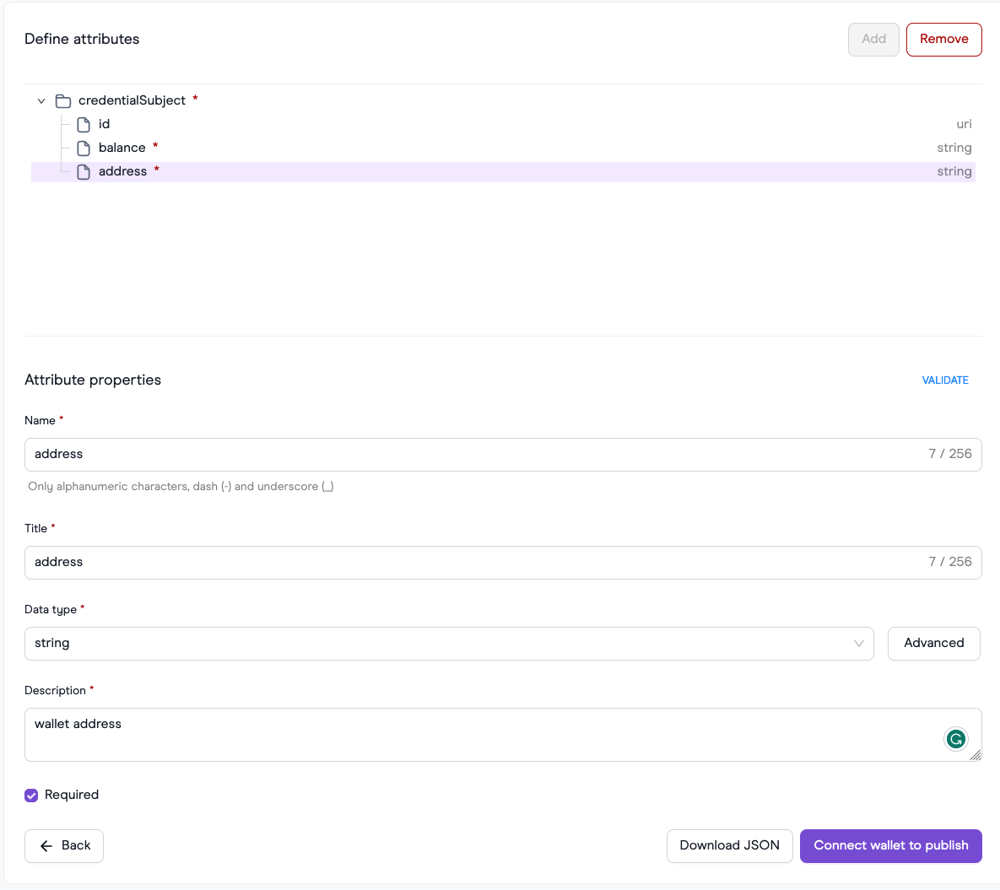

# Refresh service

## Description

Verifiable credentials are subject to expiration. In certain scenarios, having mechanisms to refresh these credentials proves beneficial. Refreshing can be carried out either manually or automatically. Through the utilization of a refresh service, we gain the ability to establish short-term credentials. This approach ensures that users are consistently using the most current information pertaining to themselves, such as their user balance, game score or other very dynamic data.

## Example of short-term credentials

As an illustration, consider our intention to issue a claim regarding a user's account balance. However, it's important to note that a user's account balance is highly dynamic in nature. If we were to issue the claim with an extended validity period, the claim holder could potentially engage in double spending activities. To counteract this issue, one possible solution is to distribute short-term credentials. However, this approach necessitates frequent interactions between the user and the issuer node. The user would be required to consistently furnish the most up-to-date information about their balance. This process can be demanding for the user and consume a substantial amount of time. Indeed, the refresh service can streamline and automate this process, making it significantly easier and more user-friendly.

## Support on the Issuer side

1. **Optional support for embedded structure**: Issuer servers may optionally support a new embedded structure within the credential request. This structure, named `refreshService`, includes an identifier and a type. For example:
    
    ```json
    "refreshService": { 
       "id": "http://refreshservice.example:8002", 
       "type": "Iden3RefreshService2023"
    }
    ```
    
2. **Validation of refresh service**: Issuers should validate whether they support the specified `refreshService.type`. Additionally, they need to check if the credential has an expiration date only if a refresh service was provided. Implementing a refresh service for long-term credentials is generally unnecessary. However, issuers can develop custom logic to suit specific requirements for their issuer and refresh services.
3. **Endpoints for Iden3RefreshService2023**: To support the `Iden3RefreshService2023` refresh service type, issuers should provide public endpoints. These endpoints may be secured using methods like API keys or basic authentication. The specific endpoints include:
    - `GET /api/v1/identities/{issuer_did}/claims/{claim_id}`: To retrieve a claim by its issuerDID and claim ID.
    - `POST /api/v1/identities/{issuer_did}/claims`: To issue a credential under an issuer.
    
    > **NOTE:** These URL are customizable for different implementations of the refresh service.
    > 
4. **Return of refreshService structure**: If a `refreshService` is added for a verifiable credential, the issuer should include the `refreshService` structure in the returned verifiable credential. This ensures the VC carries information about its refresh capabilities.

## Algorithm of client  interaction with refresh service

To implement credential refreshing, we need to follow the following algorithm to look up the credentials when a proof request is received:

- **Auto refresh**
    
    
    
    
    **Select all credentials that satisfy context + type. If not found, return an error.**
    
    - In this step, you are searching for credentials based on a specified context and type. If credentials are found, they proceed to the next step. Otherwise, an error is returned.
    
    **If credentials are found, check the skipRevocation flag.**
    
    - If credentials are retrieved in the previous step, the algorithm checks the value of the `skipRevocation` flag from the proof request. If it is set to **true**, the algorithm skips the revocation check and moves on to the next step. If **false**, it proceeds to the revocation check.
    
    **Check revocation for selected credentials if needed.**
    
    - If the `skipRevocation` flag is false, this step involves verifying whether the selected credentials have been revoked. If all credentials are revoked - return an error.
    
    **Select all credentials that are non-expired and matched to the proof request.**
    
    - This step involves filtering out credentials that are expired and(or) don't match the proof request. If non-expired and matched to proof request credential(s) was/were found. Try to generate proof.
    
    **If valid credentials are not found, filter all credentials that have a refresh service.**
    
    - If there are no suitable credentials in the previous step, the algorithm filters out credentials that have a refresh service. These are credentials that can be refreshed.
    
    **Select one credential with a refresh service and refresh it.**
    
    - From the credentials with refresh services, the algorithm selects one and initiates a refresh. After refreshing, the algorithm saves the updated credential.
    
    **Check if the refreshed credential satisfies the proof request. If yes, try to generate proof. If no, repeat previous step.**
    
    - After refreshing the credential, the algorithm checks if the updated credential satisfies the proof request. If it does, the algorithm attempts to generate a proof. If the credential still doesn't meet the proof request, the process repeats, selecting another credential with a refresh service and refreshing it.
- **Manual refresh**
    
    
    
    **Select all credentials that satisfy context + type. If not found, return an error.**
    
    - In this step, you are searching for credentials based on a specified context and type. If any credentials are found, they proceed to the next step. Otherwise, an error is returned.
    
    **If credentials are found, check the skipRevocation flag.**
    
    - If credentials are retrieved in the previous step, the algorithm checks the value of the `skipRevocation` flag from the proof request. If it is set to **true**, the algorithm skips the revocation check and moves on to the next step. If **false**, it proceeds to the revocation check.
    
    **Check revocation for selected credentials if needed.**
    
    - If the `skipRevocation` flag is false, this step involves verifying whether the selected credentials have been revoked. If all credentials are revoked - return an error.
    
    **Select all credentials that are non-expired and matched to the proof request.**
    
    - This step involves filtering out credentials that are expired and(or) don't match the proof request. If non-expired and matched to proof request credential(s) was/were found. Try to generate proof.
    
    I**f valid credentials are not found, filter all credentials that have a refresh service.**
    
    - If there are no suitable credentials in the previous step, the algorithm filters out credentials that have a refresh service. These are credentials that can be refreshed.
    
    **Initialize User Interface (UI):**
    
    - Display filtered credentials with refreshed services.
    - Each credential has two special markers:
        - An "expired" marker if the credential is out of date.
        - A "non-matched" marker if the credential does not match the proof request.
    
    **User Interaction:**
    
    - The user has the option to initiate a refresh process by pressing a "refresh" button near each credential.
    - The user has the option to mark the credential as an `auto refresh` which means that for the type of credentials, we should use automation refresh flow.
    
    **Credential Refresh Process:**
    
    - When the "refresh" button is pressed, the system triggers a call to a "refresh service."
    - The refresh service attempts to update the selected credential.
    
    **Post-Refresh Validation:**
    
    - After a credential is refreshed, the system saves the refreshed credential.
    - It then checks whether the refreshed credential matches the proof request criteria.
        - If it matches, the system proceeds to generate proof.
        - If it does not match, the system returns the user to the UI with the list of credentials, indicating that a different credential may need to be refreshed.


>💡 **NOTE:** If expired credentials are revoked, the current recommended algorithm will not process or update such credentials.
>


## Client communication with refresh service:

If the refreshServer section within a verifiable credential is of type **Iden3RefreshService2023**, the user is required to construct a  [refresh Iden3Comm ZKP message](https://iden3-communication.io/credentials/1.0/refresh/). This message should then be sent to the agent endpoint specified by `refreshServer.id`.

## Changes in the verifiable credential

In our scenario, the revocation service is integrated into the verifiable credential itself:

```json
{
  "@context": [
    "https://www.w3.org/2018/credentials/v1",
    ...
  ],
  ...
  "refreshService": {
		"id": "https://refreshService.example", // agent
    "type": "Iden3RefreshService2023"
  }
}
```

The data model of `refershService`:

| Field name | Data type | Description | Required |
| --- | --- | --- | --- |
| type | string | Type of refresh service. | ✅ |
| id | string | Refresh service identification | ✅ |

Supported types:

1. **Iden3RefreshService2023:** for this type, the ID is equal to the refresh service agent URL.

## Proposal

Schema of workflow:


1. The verifier initiates a proof request to the holder.
2. The holder attempts to locate credentials based on the request.
3. The holder verifies the expiration date.
4. The holder sends a `Refresh request` to the `refreshService` within the verifiable credential.
5. The `refreshService` examines whether a refreshed claim exists in the chance layer. If one exists, the service retrieves a cached VC. If the record has a `pending` status, the `refreshService` responds with a `pending` status code.
6. The `refreshService` sends a request to the issuer node to retrieve claim information.
7. The issuer node provides the claim details to the `refreshService`.
8. The `refreshService` validates the VC's expiration date.
9. Using the VC's `credential type + context`, the `refreshService` selects a data provider and makes a request.
10. The `refreshService` contacts the `issuer node` to create a new claim using the data received from the data provider.
11. The `issuer node` generates the refreshed claim and sends it to the `refreshService`.
12. The `refreshService` delivers an [issuance response](https://iden3-communication.io/credentials/1.0/issuance-response/) to the holder's mobile app or extension.
    
    **Signature (SIG):**
    
    1. The `refreshService` provides the refreshed credential to the holder.
    2. The holder can generate a proof for the signature request.
    
    Merkle tree proof **(MTP):**

    The workflow for MTP is in development. However, you still receive notifications about MTP proof on the mobile application after refreshing credentials that have MTP proof.

    1. The `refreshService` informs the holder about the `pending` status.
    2. The holder monitors the credential status for a certain duration.
    
    **In cases where the holder intends to generate proof for an MTP proof request but their credential has been refreshed, the holder should decline the proof request. This is because generating an MTP proof might require a significant amount of time to become ready.**
    

## Integration examples:

1. Golang integration:
    1. Issue a credential with RefreshService and use the RefreshService to generate proof: https://github.com/iden3/identity-server/pull/309
    2. Issuer a credential with RefresService only: https://github.com/0xPolygonID/issuer-node/pull/581
2. JS integration:
    1. https://github.com/0xPolygonID/js-sdk/pull/165.

# Refresh service customization

## How to build refresh service

Here are three potential scenarios for customizing the refresh service:

1. Utilize the [flexible HTTP package](https://github.com/0xPolygonID/refresh-service/blob/main/providers/flexiblehttp/http.go) to configure HTTP requests to a data provider. Refer to the [configuration guide](https://github.com/0xPolygonID/refresh-service/blob/main/README.md) for instructions on how to set this up.
2. Extend customization by incorporating custom providers and integrating them into the refresh flow. Adjust [the default provider](https://github.com/0xPolygonID/refresh-service/blob/main/service/refresh.go#L82-L92) to use the desired custom data provider.
3. For ultimate customization, consider implementing the refresh service from scratch to tailor it precisely to your specific needs.

**Custom provider example:**

> **NOTE: This example demonstrates the creation a custom data provider for the refresh service. You can repeat this example only if you use this [issuer-node](https://github.com/0xPolygonID/issuer-node/).**
> 

**Preparation:**

1. **Run issuer-node locally:** Follow the [quick-start installation guide](https://github.com/0xPolygonID/issuer-node/#quick-start-installation).
2. **Build a schema via [schema builder](https://schema-builder.polygonid.me/builder):**
    1. For this example, build a `Balance` schema.
    2. Create a JSON schema:
        
        
        
    3. Build a JSON LD schema:
        
        
        
        > **NOTE:** The schema builder doesn't support the positiveInteger type, but the protocol does. Manually change this after schema creation:
        > 
        
        ```json
        "balance": {
           "@id": "polygon-vocab:balance",
           "@type": "xsd:positiveInteger"
        }
        ```
        
3. Push to IPFS or host on an HTTP(s) service like GitHub Gist:

    [Example of JSON schema](https://gist.github.com/ilya-korotya/ac6301168991e798a8f316944a3f2f58)
    
    [Example of JSONLD schema](https://gist.github.com/ilya-korotya/1549ee89a053bc42a98e53392dafc6f6)
4. Add the custom data provider to the [providers](https://github.com/0xPolygonID/refresh-service/tree/main/providers) package. The data provider should call an external service to fetch data and return the data in `map[string]any` format. The keys of the object should match the credential subject of the credential. An example implementation of a custom provider can be found [here](https://github.com/0xPolygonID/refresh-service/pull/5).
5. Navigate to the UI of your hosted issuer-node and issue a credential with the refresh service.
    
    
    
6. After the expiration of this credential, it is possible to refresh the credential in the verification step under the hood. Visit [verifier-demo.polygonid.me](https://verifier-demo.polygonid.me/) and create a custom request with your schema, etc. During the verification process, the expired credential will be refreshed and used to generate a proof.

**Refresh service from scratch:**

In its simplest form, the refresh service is designed with four integral components:

1. **[HTTP Server](https://github.com/0xPolygonID/refresh-service/tree/main/server)**: This server plays a pivotal role by supporting the iden3comm protocol. Specifically, it is equipped to process the [refresh iden3comm message](https://iden3-communication.io/credentials/1.0/refresh/), ensuring seamless communication within the ecosystem.
2. **[Provider Module](https://github.com/0xPolygonID/refresh-service/tree/main/providers)**: is a crucial component within the refresh service architecture. This module is designed to fetch data from external data providers, offering users a high degree of flexibility to implement custom logic based on their specific requirements. The primary function of the Provider Module is to interact with external services to gather relevant information needed for the overall operation of the refresh service. Examples of such logic include sending HTTP requests to Etherscan for real-time transaction status, making JSONRPC calls to the blockchain for valid balance data, or establishing connections with game providers to retrieve the current user level.
3. **[Package Manager](https://github.com/0xPolygonID/refresh-service/blob/main/packagemanager/packagemanager.go)**: The package manager adds a critical layer of functionality to the refresh service by introducing the capability to manage JWZ tokens within the iden3comm protocol. This ensures efficient handling and governance of JWZ tokens, contributing to the overall robustness of the system.
4. **[Integration with the Issuer Node](https://github.com/0xPolygonID/refresh-service/blob/main/service/issuer.go)**: This module demands adherence to strict integration rules. For instance, the [issuer node](https://github.com/0xPolygonID/issuer-node/) must provide two public endpoints accessible to the wider ecosystem:

    4.1. `/v1/{{IssuerDID}}/claims/{{credentialID}}`: This endpoint facilitates the retrieval of additional details about the credential that requires refreshing, providing a comprehensive understanding of the credential's state.
    
    4.2. `/v1/{{IssuerDID}}/claims`: This endpoint is dedicated to the issuance of new credentials, ensuring a seamless process for credential generation within the refresh service.

In summary, the refresh service is a comprehensive system, encompassing an HTTP Server for protocol support, a flexible Provider Module for custom logic, a Package Manager for JWZ token management, and a strict Integration with the Issuer Node for seamless credential handling and issuance.

**Authentication module for setup iden3comm handler** 

To ascertain whether a user is the rightful owner of the credentials they intend to refresh, it is essential to implement an authentication module. To initiate the process, you should initialize the [Iden3comm package manager](https://github.com/0xPolygonID/refresh-service/blob/main/packagemanager/packagemanager.go).

In the context of a refresh service where JWZ tokens are verified, you will require the verification_key.json for the authV2 circuit. Additionally, to confirm the existence of the user in the issuer's state, one needs to know the issuer's state contract:

State contract for **Polygon** **Mumbai**: `0x134B1BE34911E39A8397ec6289782989729807a4`
State contract for **Polygon** **Mainnet**: `0x624ce98D2d27b20b8f8d521723Df8fC4db71D79D`

To authorise the user’s JWZ token, it is necessary to define a function that verifies proof and the issuer’s state. Once the authorization is complete, the refresh service will be aware of the user’s DID from the JWZ token. This enables a comparison to ensure that the credential being refreshed contains the same DID in the credential subject.

> **NOTE:** It is crucial to verify whether a user is the owner of the credential that potentially will be refreshed. Without this verification, an attacker could refresh and obtain a third-party credential.
> 

**********************************************************Integration with issuer node**********************************************************

The refresh service acts as a 'proxy' between the data provider and the issuer node, facilitating communication between them. The refresh service must possess the capability to communicate with the issuer node through open endpoints. These endpoints should be secured using various methods, such as JWT tokens, Basic Auth, etc. On the issuer-node side, only two open endpoints should be accessible:

1. `GET /v1/{{IssuerDID}}/claims/{{credentialID}}` - This endpoint is designed to return a credential based on the provided credentialID. Refer to the Issuer node example for implementation details.
2. `POST /v1/{{IssuerDID}}/claims` - This endpoint accepts a JSON body from which a new credential will be created. The IssuerDID is a crucial parameter for this operation. See the Issuer node example for reference on how this endpoint can be implemented.

**Credential request for issuance**

Currently, Polygon ID (comprising the issuer-node and mobile application) supports only one type of refresh service [Iden3RefreshService2023](https://github.com/iden3/claim-schema-vocab/blob/530409dcabb7e554a26351df3ecc4cb3417ee472/core/jsonld/iden3proofs.jsonld#L284). This means that if you want to maintain a credential with the ability to refresh it, the user must provide information about the refresh service in the credential request. An example of such a request is:

```json
{
  "credentialSchema": "ipfs://QmbFX4xduwo1kn5dwyaT2JkJ5BSmUfi5UaPTY1qVW7k6tc",
  "credentialSubject": {
    "id": "did:polygonid:polygon:mumbai:2qKDJmySKNi4GD4vYdqfLb37MSTSijg77NoRZaKfDX",
    "position": 1
  },
  "mtProof": false,
  "signatureProof": true,
  "type": "TestInteger01",
  "refreshService": {
      "id": "http://refresh.xyz",
      "type": "Iden3RefreshService2023"
  }
}
```

`refreshService.id` - URL to refresh service that supports iden3comm protocol endpoint.

`type` - type of refresh service.

Let's consider the diagram that describes in detail the algorithm of the refresh service


1. The user initiates a Zero-Knowledge Proof (ZKP) refresh process by sending a refresh message through the [iden3comm protocol](https://iden3-communication.io/credentials/1.0/refresh/) to the refresh service.
2. This message contains essential information, including the ID of the credential requiring refresh.
3. The refresh service performs an HTTP request to the `GET /v1/{issuerDID}/claims/{credentialID}` endpoint to retrieve comprehensive information about the specific credential that requires an update.
4. The algorithm then validates whether the user is the legitimate owner of this credential.
5. The refresh service seeks current information for the user and their credential from the data provider. (It is possible to have a single refresh service for different credential types or one per credential type.)
6.  The refresh service must now assess whether refreshed data are suitable for refreshing the credential, considering the following scenarios:
    
    ◦ If the credential was **merklized**, and its merkle tree root was stored in the index part, it is eligible for a refresh.
    
    ◦ If the credential was **NOT merklized**, a check is necessary to determine whether the data stored in the index were updated during the refreshing flow. If the data has not been updated, adding identical indexes to the issuer’s tree will result in an error. An example of how to perform this check can be found [here](https://github.com/0xPolygonID/refresh-service/blob/e9c310fc3808e1f58ce108523b4fd07dd67800ed/service/refresh.go#L175).
    
    ◦ In other cases, the refresh service should return an error.
7. With the new data from the data provider, the refresh service generates a credential request and sends it to the issuer node via the `POST /v1/{issuerDID}/claims` endpoint. The issuer node is expected to respond with a new credential ID.
8. Using this ID, the refresh service obtains a new credential through the `GET /v1/{issuerDID}/claims/{newCredentialID}` endpoint. 
9. Thne the refreshed credential is then packaged into an iden3comm message and sent back to the user.
