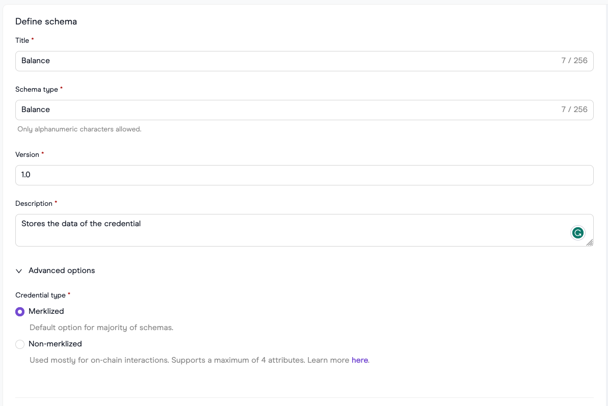
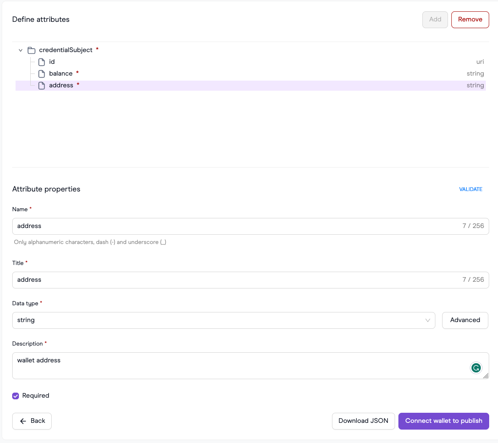
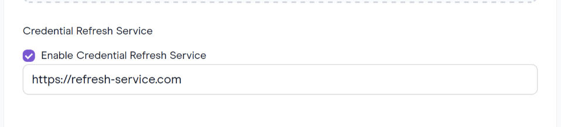
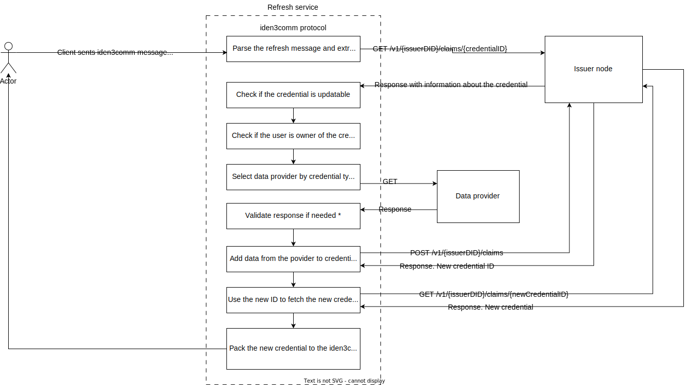

# Refresh service customization

## How to build refresh service

Here are three potential scenarios for customizing the refresh service:

1. Utilize the [flexible HTTP package](https://github.com/0xPolygonID/refresh-service/blob/main/providers/flexiblehttp/http.go) to configure HTTP requests to a data provider. Refer to the [configuration guide](https://github.com/0xPolygonID/refresh-service/blob/main/README.md) for instructions on how to set this up.
2. Extend customization by incorporating custom providers and integrating them into the refresh flow. Adjust [the default provider](https://github.com/0xPolygonID/refresh-service/blob/main/service/refresh.go#L82-L92) to use the desired custom data provider.
3. For ultimate customization, consider implementing the refresh service from scratch to tailor it precisely to your specific needs.

**Custom provider example:**

> **NOTE: This example demonstrates the creation a custom data provider for the refresh service. You can repeat this example only if you use this [issuer-node](https://github.com/0xPolygonID/issuer-node/).**
> 

**Preparation:**

1. **Run issuer-node locally:** Follow the [quick-start installation guide](https://github.com/0xPolygonID/issuer-node/#quick-start-installation).
2. **Build a schema via [schema builder](https://schema-builder.polygonid.me/builder):**
    1. For this example, build a `Balance` schema.
    2. Create a JSON schema:
        
        
        
    3. Build a JSON LD schema:
        
        
        
        > **NOTE:** The schema builder doesn't support the positiveInteger type, but the protocol does. Manually change this after schema creation:
        > 
        
        ```json
        "balance": {
           "@id": "polygon-vocab:balance",
           "@type": "xsd:positiveInteger"
        }
        ```
        
3. Push to IPFS or host on an HTTP(s) service like GitHub Gist:

    [Example of JSON schema](https://gist.github.com/ilya-korotya/ac6301168991e798a8f316944a3f2f58)
    
    [Example of JSONLD schema](https://gist.github.com/ilya-korotya/1549ee89a053bc42a98e53392dafc6f6)
4. Add the custom data provider to the [providers](https://github.com/0xPolygonID/refresh-service/tree/main/providers) package. The data provider should call an external service to fetch data and return the data in `map[string]any` format. The keys of the object should match the credential subject of the credential. An example implementation of a custom provider can be found [here](https://github.com/0xPolygonID/refresh-service/pull/5).
5. Navigate to the UI of your hosted issuer-node and issue a credential with the refresh service.
    
    
    
6. After the expiration of this credential, it is possible to refresh the credential in the verification step under the hood. Visit [verifier-demo.polygonid.me](https://verifier-demo.polygonid.me/) and create a custom request with your schema, etc. During the verification process, the expired credential will be refreshed and used to generate a proof.

**Refresh service from scratch:**

In its simplest form, the refresh service is designed with four integral components:

1. **[HTTP Server](https://github.com/0xPolygonID/refresh-service/tree/main/server)**: This server plays a pivotal role by supporting the iden3comm protocol. Specifically, it is equipped to process the [refresh iden3comm message](https://iden3-communication.io/credentials/1.0/refresh/), ensuring seamless communication within the ecosystem.
2. **[Provider Module](https://github.com/0xPolygonID/refresh-service/tree/main/providers)**: is a crucial component within the refresh service architecture. This module is designed to fetch data from external data providers, offering users a high degree of flexibility to implement custom logic based on their specific requirements. The primary function of the Provider Module is to interact with external services to gather relevant information needed for the overall operation of the refresh service. Examples of such logic include sending HTTP requests to Etherscan for real-time transaction status, making JSONRPC calls to the blockchain for valid balance data, or establishing connections with game providers to retrieve the current user level.
3. **[Package Manager](https://github.com/0xPolygonID/refresh-service/blob/main/packagemanager/packagemanager.go)**: The package manager adds a critical layer of functionality to the refresh service by introducing the capability to manage JWZ tokens within the iden3comm protocol. This ensures efficient handling and governance of JWZ tokens, contributing to the overall robustness of the system.
4. **[Integration with the Issuer Node](https://github.com/0xPolygonID/refresh-service/blob/main/service/issuer.go)**: This module demands adherence to strict integration rules. For instance, the [issuer node](https://github.com/0xPolygonID/issuer-node/) must provide two public endpoints accessible to the wider ecosystem:

    4.1. `/v1/{{IssuerDID}}/claims/{{credentialID}}`: This endpoint facilitates the retrieval of additional details about the credential that requires refreshing, providing a comprehensive understanding of the credential's state.
    
    4.2. `/v1/{{IssuerDID}}/claims`: This endpoint is dedicated to the issuance of new credentials, ensuring a seamless process for credential generation within the refresh service.

In summary, the refresh service is a comprehensive system, encompassing an HTTP Server for protocol support, a flexible Provider Module for custom logic, a Package Manager for JWZ token management, and a strict Integration with the Issuer Node for seamless credential handling and issuance.

**Authentication module for setup iden3comm handler** 

To ascertain whether a user is the rightful owner of the credentials they intend to refresh, it is essential to implement an authentication module. To initiate the process, you should initialize the [Iden3comm package manager](https://github.com/0xPolygonID/refresh-service/blob/main/packagemanager/packagemanager.go).

In the context of a refresh service where JWZ tokens are verified, you will require the verification_key.json for the authV2 circuit. Additionally, to confirm the existence of the user in the issuer's state, one needs to know the issuer's state contract:

State contract for **Polygon** **Mumbai**: `0x134B1BE34911E39A8397ec6289782989729807a4`
State contract for **Polygon** **Mainnet**: `0x624ce98D2d27b20b8f8d521723Df8fC4db71D79D`

To authorise the user’s JWZ token, it is necessary to define a function that verifies proof and the issuer’s state. Once the authorization is complete, the refresh service will be aware of the user’s DID from the JWZ token. This enables a comparison to ensure that the credential being refreshed contains the same DID in the credential subject.

> **NOTE:** It is crucial to verify whether a user is the owner of the credential that potentially will be refreshed. Without this verification, an attacker could refresh and obtain a third-party credential.
> 

**********************************************************Integration with issuer node**********************************************************

The refresh service acts as a 'proxy' between the data provider and the issuer node, facilitating communication between them. The refresh service must possess the capability to communicate with the issuer node through open endpoints. These endpoints should be secured using various methods, such as JWT tokens, Basic Auth, etc. On the issuer-node side, only two open endpoints should be accessible:

1. `GET /v1/{{IssuerDID}}/claims/{{credentialID}}` - This endpoint is designed to return a credential based on the provided credentialID. Refer to the Issuer node example for implementation details.
2. `POST /v1/{{IssuerDID}}/claims` - This endpoint accepts a JSON body from which a new credential will be created. The IssuerDID is a crucial parameter for this operation. See the Issuer node example for reference on how this endpoint can be implemented.

**Credential request for issuance**

Currently, Polygon ID (comprising the issuer-node and mobile application) supports only one type of refresh service [Iden3RefreshService2023](https://github.com/iden3/claim-schema-vocab/blob/530409dcabb7e554a26351df3ecc4cb3417ee472/core/jsonld/iden3proofs.jsonld#L284). This means that if you want to maintain a credential with the ability to refresh it, the user must provide information about the refresh service in the credential request. An example of such a request is:

```json
{
  "credentialSchema": "ipfs://QmbFX4xduwo1kn5dwyaT2JkJ5BSmUfi5UaPTY1qVW7k6tc",
  "credentialSubject": {
    "id": "did:polygonid:polygon:mumbai:2qKDJmySKNi4GD4vYdqfLb37MSTSijg77NoRZaKfDX",
    "position": 1
  },
  "mtProof": false,
  "signatureProof": true,
  "type": "TestInteger01",
  "refreshService": {
      "id": "http://refresh.xyz",
      "type": "Iden3RefreshService2023"
  }
}
```

`refreshService.id` - URL to refresh service that supports iden3comm protocol endpoint.

`type` - type of refresh service.

Let's consider the diagram that describes in detail the algorithm of the refresh service



1. The user initiates a Zero-Knowledge Proof (ZKP) refresh process by sending a refresh message through the [iden3comm protocol](https://iden3-communication.io/credentials/1.0/refresh/) to the refresh service.
2. This message contains essential information, including the ID of the credential requiring refresh.
3. The refresh service performs an HTTP request to the `GET /v1/{issuerDID}/claims/{credentialID}` endpoint to retrieve comprehensive information about the specific credential that requires an update.
4. The algorithm then validates whether the user is the legitimate owner of this credential.
5. The refresh service seeks current information for the user and their credential from the data provider. (It is possible to have a single refresh service for different credential types or one per credential type.)
6.  The refresh service must now assess whether refreshed data are suitable for refreshing the credential, considering the following scenarios:
    
    ◦ If the credential was **merklized**, and its merkle tree root was stored in the index part, it is eligible for a refresh.
    
    ◦ If the credential was **NOT merklized**, a check is necessary to determine whether the data stored in the index were updated during the refreshing flow. If the data has not been updated, adding identical indexes to the issuer’s tree will result in an error. An example of how to perform this check can be found [here](https://github.com/0xPolygonID/refresh-service/blob/e9c310fc3808e1f58ce108523b4fd07dd67800ed/service/refresh.go#L175).
    
    ◦ In other cases, the refresh service should return an error.
7. With the new data from the data provider, the refresh service generates a credential request and sends it to the issuer node via the `POST /v1/{issuerDID}/claims` endpoint. The issuer node is expected to respond with a new credential ID.
8. Using this ID, the refresh service obtains a new credential through the `GET /v1/{issuerDID}/claims/{newCredentialID}` endpoint. 
9. Thne the refreshed credential is then packaged into an iden3comm message and sent back to the user.
